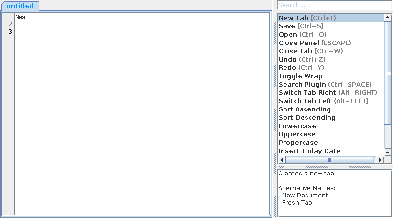

# Neat

A Java-based plugin-driven text editor.



Did you notice the menu bar? Yeah, you are right, there is none.
The editor's functionality is covered with plugins which are searchable and
permanently shown on the right side. You can assign shortcuts involving control, alt and shift.

Table of Content:

<!-- TOC depthFrom:2 depthTo:6 withLinks:1 updateOnSave:1 orderedList:0 -->

- [How to plug in](#how-to-plug-in)
	- [Where are the plugins stored](#where-are-the-plugins-stored)
	- [How to program a plugin](#how-to-program-a-plugin)
	- [How to describe a plugin package](#how-to-describe-a-plugin-package)
	- [Create a Maven project](#create-a-maven-project)
- [How to use](#how-to-use)

<!-- /TOC -->

## How to plug in


### Where are the plugins stored

`${user.home}` refers to the user's home directory. In `${user.home}/.neat/plugins`
the plugins' Java bytecode (*.class files) and meta-data JSON files are stored.
When the Neat editor is started the plugins are loaded by automatically adding the classpath
`${user.home}/.neat/plugins` to the JVM and reading all JSON files from this directory.

### How to program a plugin

A plugin is just a static method always having as first argument `EditorPluginContext` and maybe optional additional arguments.
Your project has to add the dependency `neat.jar`.

```java
import com.github.mschroeder.github.neat.EditorPluginContext;

public class MyPluginClass {

  public static void myPluginMethod(EditorPluginContext ctx) {
    //...
  }

  public static void myPluginMethod2(EditorPluginContext ctx, boolean b, int i, String s) {
    //...
  }

}
```

From `EditorPluginContext` you have access to all relevant objects:
* `EditorFrame` is the main frame containing a tabbed pane with `EditorPanel`-tabs and the plugin list.
  * `EditorPanel` is the context for the text file with file-related settings like encoding.
    * `JTextAreaEditor` is the actual text area.

### How to describe a plugin package

The Neat editor reads plugin packages from JSON meta-data files.

* **name**: Give the package a name.
* **author**: Your name.
* **visible**: An array of all plugins that will be visible in the editor.
  * A plugin is described with a JSON object having the following keys:
    * **prefLabel**: The label the is shown in the plugin list.
    * **altLabel**: Alternative labels that are used in the plugin search.
    * **description**: A longer description what the plugin does. It is shown to the user
    when the plugin is focused.
    * **shortcut**: Optional shortcut to run the plugin.
    * **method**: The path to the method.
    * **args**: The argument values if additional method arguments are used.
* **hidden**: An array of all plugins that should be hidden (disabled).

Put your plugin package JSON file in `${user.home}/.neat/plugins`.


```json
{
    "name": "Package Name",
    "author": "Author Name",

    "visible": [
        {
            "prefLabel": "Prefered Name",
            "altLabels": ["Alternate Name", ...],
            "description": "A long text description.",
            "shortcut" : { "ctrl": true, "alt": false, "shift": false, "key": "L" },
            "method" : "org.example.MyPluginClass.myPluginMethod2",
            "args": [true, 5, "str"]
        },
        ...
    ],

    "hidden": [
        ...
    ]
}
```

### Create a Maven project

Create a new Maven project with the `pom.xml` description below.
Add to the `dependencies` the dependency to `neat`.
Use the `maven-antrun-plugin` to copy all classes and JSON meta-data files to the
`${user.home}/.neat/plugins` directory.
Use `src/main/resources` directory to store your plugin package description.

```xml
<?xml version="1.0" encoding="UTF-8"?>
<project xmlns="http://maven.apache.org/POM/4.0.0" xmlns:xsi="http://www.w3.org/2001/XMLSchema-instance" xsi:schemaLocation="http://maven.apache.org/POM/4.0.0 http://maven.apache.org/xsd/maven-4.0.0.xsd">
    <modelVersion>4.0.0</modelVersion>

    <groupId>...</groupId>
    <artifactId>...</artifactId>
    <version>...</version>
    <packaging>jar</packaging>

    <dependencies>
        <dependency>
            <groupId>com.github.mschroeder.github</groupId>
            <artifactId>neat</artifactId>
            <version>1.0.0</version>
        </dependency>
    </dependencies>

    <build>
        <plugins>
            <plugin>
                <artifactId>maven-antrun-plugin</artifactId>
                <version>1.8</version>
                <executions>
                    <execution>
                        <id>copy</id>
                        <phase>package</phase>
                        <configuration>
                            <target>
                                <echo>classes</echo>
                                <copy todir="${user.home}/.neat/plugins" overwrite="true">
                                    <fileset dir="${basedir}/target/classes" >
                                    </fileset>
                                </copy>

                                <echo>json config file</echo>
                                <copy todir="${user.home}/.neat/plugins" overwrite="true" flatten="true">
                                    <fileset dir="${basedir}" >
                                        <include name="target/classes/**/*.json" />
                                    </fileset>
                                </copy>
                            </target>
                        </configuration>
                        <goals>
                            <goal>run</goal>
                        </goals>
                    </execution>
                </executions>
            </plugin>
        </plugins>
    </build>

</project>
```

## How to use

The `Search Plugin`-Plugin (default shortcut ctrl+space) focuses the text field to
search plugins. Using a fuzzy match the plugins are sorted by best matches (also alternative
labels are searched).
Use down and up key to browse the list and enter to use the plugin.
Alternatively, you can left double click on a plugin in the list.
Below, the description of a focused plugin is shown in a text area.
Use escape key to return to the editor's text area.
